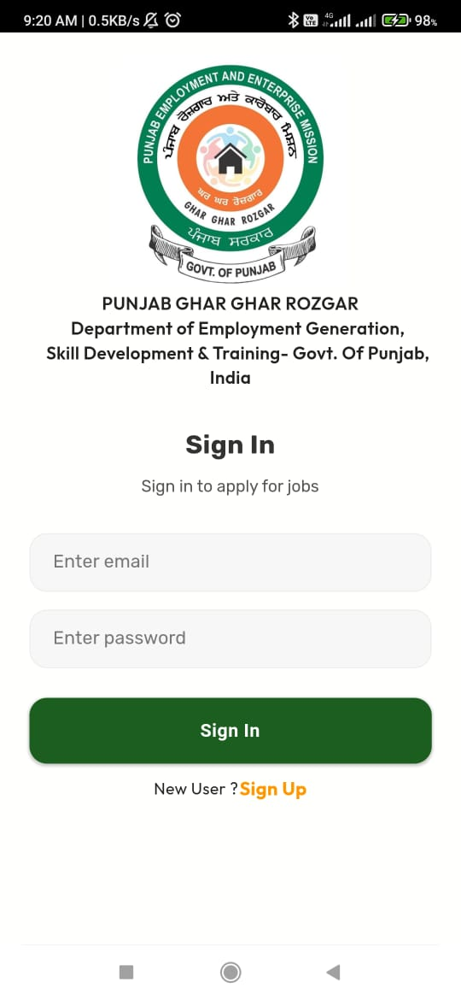
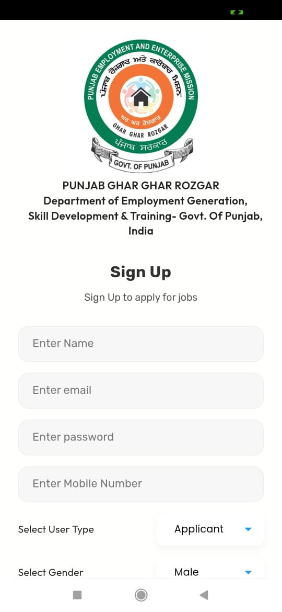
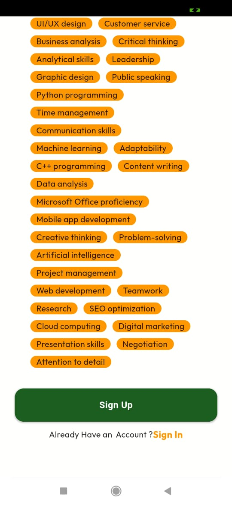
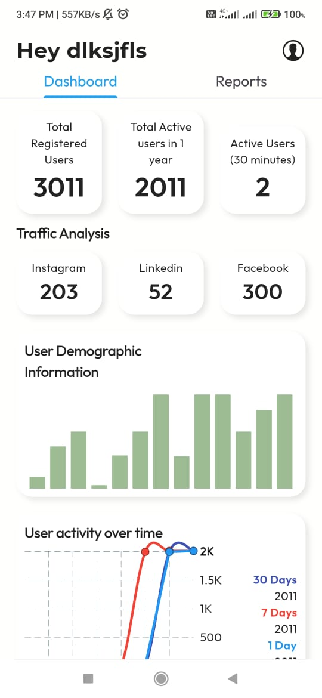
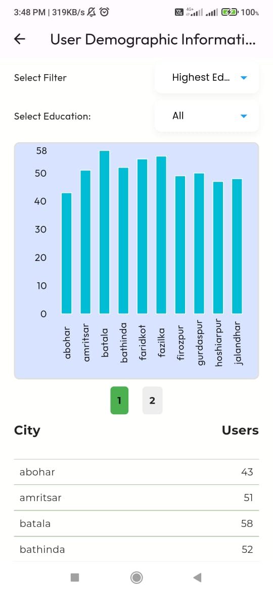
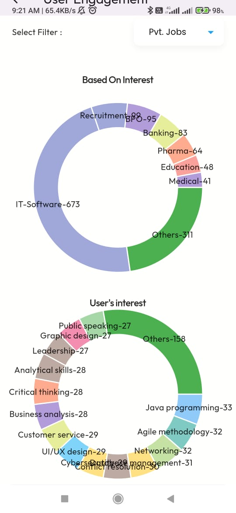

# PGRKAM Analytics Tool - Flutter Integration

## Overview

The PGRKAM Analytics Tool is a Flutter-based analytics solution designed to empower administrators by tracking user behavior within the PGRKAM app. This tool captures crucial details, providing insights into user engagement, demographics, and the overall user experience.











## Features

### 1. User Engagement Tracking

- **Channel Attribution:** Capture the channel through which users spot PGKAM advertisements, gaining insights into effective marketing channels.

- **Webpage/Service Interaction:** Monitor user interactions with webpages and services to understand preferences and interests.

### 2. User Demographics

- **Demographic Analysis:** Gather demographic information to tailor services based on the diverse user base.

### 3. Job Matching and Recommendations

- **Job Suggestions:** Utilize algorithms like Genetic Algorithm or Collaborative Filtering for personalized job suggestions.

- **Success/Failure Analysis:** Analyze the success/failure rate of user profiles concerning job requirements.

### 4. Real-time Visualization

- **Interactive Dashboards:** Visualize analytics data through interactive dashboards for real-time monitoring.

- **User Flow Analysis:** Understand user journeys by visualizing movement across the PGRKAM app.

## Flutter Integration

To integrate the PGRKAM Analytics Tool into your Flutter project, follow these steps:

1. **Clone the Repository:**

   ```
   git clone https://github.com/AyushKrSingh000/pgrkam.git
   ```

2. **Navigate to the Project Directory:**

   ```
   cd pgrkam-analytics-flutter
   ```

3. **Update Dependencies:**

   ```
   flutter pub get
   ```

4. **Configure the Tool:**

   Update necessary settings and API keys in the configuration files.

5. **Run the App:**

   ```
   flutter run
   ```

## Expected Outcome

Upon successful integration, the PGRKAM Analytics Tool will provide administrators with a powerful platform in your Flutter app to:

- Track user movement and behavior across the PGRKAM app.
- Generate real-time reports and analytics related to user profiles and behavior.
- Receive insights into success and failure rates of user profiles concerning job requirements.
- Enhance user experience through informed decision-making based on comprehensive analytics.

Feel free to customize and extend the Flutter components to suit your specific needs.

`Note: Ensure that your Flutter project meets the necessary requirements for this integration.`
